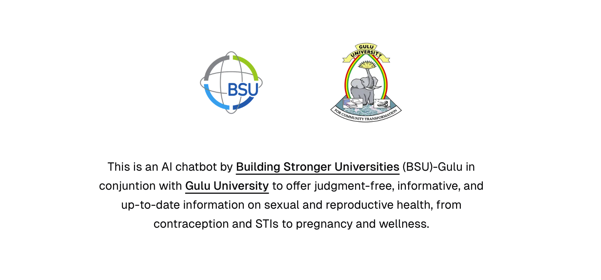

<a href="#">
  
  <h1 align="center">SRH AI Chatbot</h1>
</a>

<p align="center">
  An AI-powered Sexual and Reproductive Health (SRH) chatbot designed specifically for Uganda, providing accessible health information and support.
</p>

<p align="center">
  <a href="#features"><strong>Features</strong></a> ·
  <a href="#model-providers"><strong>Model Providers</strong></a> ·
  <a href="#deploy-your-own"><strong>Deploy Your Own</strong></a> ·
  <a href="#running-locally"><strong>Running locally</strong></a>
</p>
<br/>

## About

The SRH AI Chatbot is designed to provide accessible, accurate, and culturally appropriate sexual and reproductive health information for users in Uganda. This chatbot serves as a digital health companion, offering:

- **Confidential Health Consultations**: Private, judgment-free conversations about sexual and reproductive health topics
- **Educational Resources**: Evidence-based information on family planning, maternal health, STI prevention, and more
- **Local Context**: Information tailored to the Ugandan healthcare system and cultural context
- **Multi-format Support**: Interactive artifacts for documents, data visualization, and educational content

## Features

### Core Functionality
- **AI-Powered Conversations**: Intelligent responses using Google's Gemini 2.0 Flash model
- **Artifact System**: Interactive workspace for creating and editing:
  - **Text Documents**: Health education materials, care plans, and informational content
  - **Data Sheets**: Health tracking, appointment schedules, and medical records
  - **Code Execution**: Health calculators and data analysis tools
  - **Image Processing**: Medical image annotation and educational diagrams

### Technical Features
- [Next.js](https://nextjs.org) App Router with React Server Components
- [AI SDK](https://sdk.vercel.ai/docs) for advanced language model integration
- [shadcn/ui](https://ui.shadcn.com) with [Tailwind CSS](https://tailwindcss.com) for modern, accessible design
- Secure data persistence with [Vercel Postgres](https://vercel.com/storage/postgres) and [Vercel Blob](https://vercel.com/storage/blob)
- [NextAuth.js](https://github.com/nextauthjs/next-auth) for secure user authentication

## AI Model

This application uses Google's Gemini 2.0 Flash model as the primary AI engine, specifically configured as the "SRH AI Chatbot model for Uganda." The model is optimized to provide:

- Culturally sensitive health information relevant to Uganda
- Evidence-based medical guidance
- Appropriate referrals to local healthcare services
- Support in multiple languages as needed

The [AI SDK](https://sdk.vercel.ai/docs) architecture allows for easy model switching if needed, supporting providers like [OpenAI](https://openai.com), [Anthropic](https://anthropic.com), and [others](https://sdk.vercel.ai/providers/ai-sdk-providers).

## Deployment

This SRH AI Chatbot can be deployed to various platforms. For Vercel deployment, you'll need to configure the following environment variables:

- `AUTH_SECRET`: Secret key for authentication
- `GOOGLE_GENERATIVE_AI_API_KEY`: API key for Google's Gemini model
- Database connection strings for Postgres
- Blob storage configuration

Refer to `.env.example` for the complete list of required environment variables.

## Running Locally

### Prerequisites

- Node.js 18+ and pnpm
- Google Generative AI API key
- PostgreSQL database (local or cloud)
- Blob storage setup

### Setup

1. **Clone and install dependencies:**
   ```bash
   git clone <repository-url>
   cd srh-ai-chatbot
   pnpm install
   ```

2. **Environment Configuration:**
   Copy `.env.example` to `.env` and configure:
   ```bash
   cp .env.example .env
   ```
   
   Fill in the required environment variables, particularly:
   - `GOOGLE_GENERATIVE_AI_API_KEY`
   - Database connection strings
   - Authentication secrets

3. **Database Setup:**
   ```bash
   pnpm db:migrate
   ```

4. **Start Development Server:**
   ```bash
   pnpm dev
   ```

The application will be available at [localhost:3000](http://localhost:3000/).

> **Security Note**: Never commit your `.env` file. It contains sensitive API keys and secrets.

## Contributing

This project aims to improve sexual and reproductive health access in Uganda. Contributions should prioritize:

- Cultural sensitivity and appropriateness
- Medical accuracy and evidence-based information
- Accessibility and usability for diverse users
- Privacy and security of health data

Please ensure any contributions align with local healthcare guidelines and ethical standards for health information systems.
